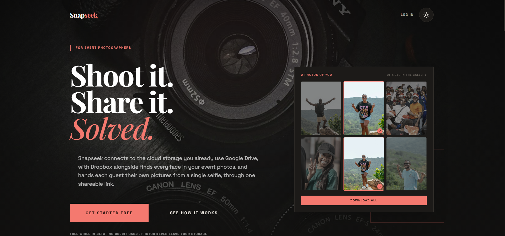
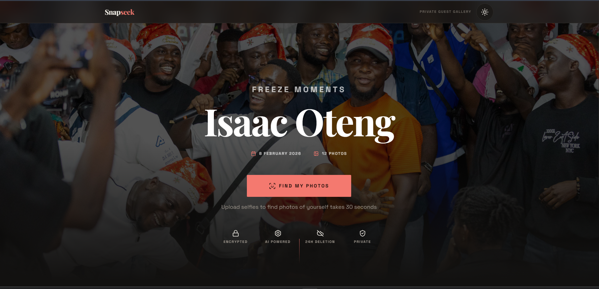
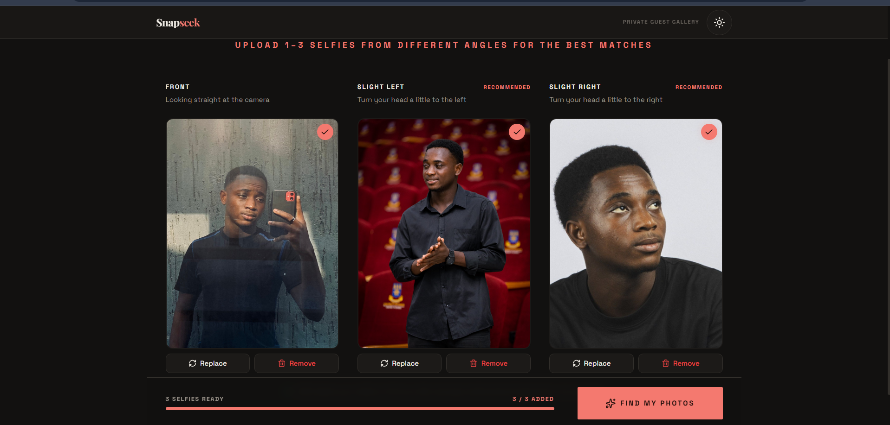
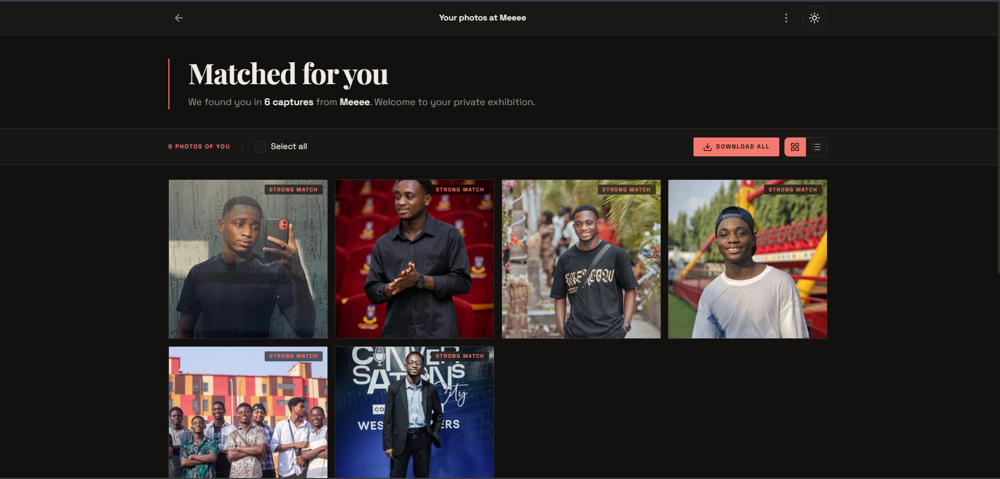
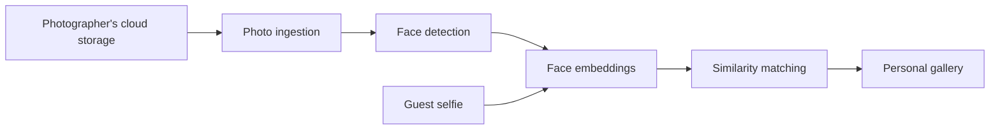
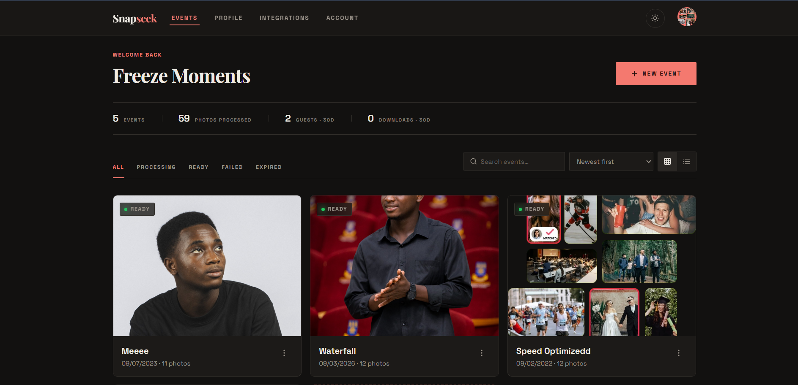
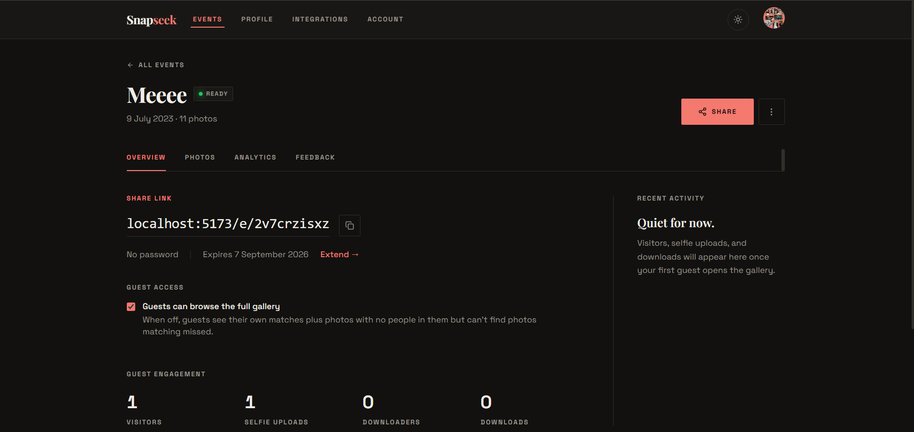

# Snapseek

**Shoot it. Share it. Solved.**

*Face-recognition photo delivery for event photographers every guest finds their own photos from a single selfie.*

---

## The problem

After an event, photographers upload hundreds or thousands of photos to a cloud folder and share one link with everyone. Guests then scroll through the entire gallery hunting for the handful of photos they actually appear in and most give up before they find them.

## What Snapseek does

Snapseek connects to the cloud storage photographers already use **Google Drive**, with **Dropbox** alongside indexes every face in an event's photos, and gives each guest their own pictures from a single selfie, through one shareable link.

- **Photographers** connect their storage, point Snapseek at an event folder, and share one link. Photos never leave their storage.
- **Guests** open the link, take a selfie, and get a personal gallery of every photo they appear in ready to download.

  

  
  

## How it works

1. The photographer links an event to a folder in their Google Drive or Dropbox.
2. Snapseek ingests the photos in the background, detects every face, and computes numeric face embeddings the photos themselves stay in the photographer's storage.
3. A guest uploads a selfie; its embedding is compared against the event's faces.
4. Matches are presented as a personal gallery with per-photo and bulk download.

## Privacy by design

Face recognition demands care. Snapseek is built to hold as little personal data as possible, for as short a time as possible:

- **Selfies are deleted within 24 hours** stored privately, never shared, never reused.
- **Embeddings are not images.** They are numeric representations that cannot be reversed into a photo.
- **Photos never leave the photographer's storage.** Snapseek references them; it does not copy the library.
- **Galleries are private by default**, with optional password protection per event.

## Tech stack

| Layer | Technology |
|---|---|
| Frontend | React, Vite, Tailwind CSS, TanStack Query |
| Backend | Django, Django REST Framework |
| Face recognition | InsightFace (ONNX Runtime) |
| Async processing | Celery + Redis |
| Storage integrations | Google Drive API, Dropbox API |
| Object storage | Cloudflare R2 (private, presigned access) |

## Engineering highlights

- **~10–20× faster face pipeline** after migrating from a TensorFlow-based stack to ONNX-based InsightFace, validated against a manual ground-truth test set.
- **Provider-agnostic storage layer** ingestion, thumbnails, and downloads route through a common interface, so Google Drive and Dropbox events work end-to-end through the same pipeline.
- **Background-first architecture** ingestion and matching run as async jobs with progress surfaced live to the client.
- **Themed, responsive UI** across three distinct surfaces: marketing site, photographer dashboard, and the guest matching flow.

  

  

## Status

Snapseek is an active final-year project (BSc). The application is fully functional end-to-end; deployment is in preparation.

**The source code is private.** I'm happy to walk through the codebase and architecture in detail [get in touch](mailto:izaacoteng@gmail.com).

---

© 2026 Isaac Oteng. All rights reserved. This repository documents the project; it does not contain or license any of its source code.
